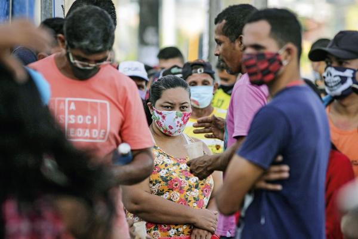

```{r setup, include=FALSE,warning=F,message=F}
knitr::opts_chunk$set(echo = FALSE,
                      fig.margin=TRUE,
                      warning = F,
                      message = F,
                      fig.height=5.5,
                      fig.width=9#,
                  #    fig.align = 'center'
                  )

lista.de.pacotes = c("tidyverse","haven","lubridate","janitor","readxl",
                     "stringr","repmis","pander","scales",
                     #"srvyr","ggstatsplot",
                     "flextable","compareGroups",
                     "magrittr","ggridges","ggpubr","ggdark",
                     "hrbrthemes","viridis","extrafont",
                     "dabestr","patchwork") # escreva a lista de pacotes

novos.pacotes <- lista.de.pacotes[!(lista.de.pacotes %in%
                                      installed.packages()[,"Package"])]
if(length(novos.pacotes) > 0) {install.packages(novos.pacotes)}
lapply(lista.de.pacotes, require, character.only=T)
rm(lista.de.pacotes,novos.pacotes)
gc()

loadfonts()

# Rodando o namespace
load("env.RData")
# Rodando o namespace
load("dados_gerais.RData")
# Rodando df3
df3 <- read_rds("df3.rds")
# filtrando apenas direita
drt.df3 <- df3 %>%
  dplyr::filter(ideologia>3)

df_join %<>% bind_rows(df3 %>% dplyr::select(names(df_join %>%dplyr::select(-Id)),covid_n,-covid) %>%
                         rename(covid=covid_n))

tema_dens <-
  theme(plot.margin = ggplot2::margin(0, 0, 0, 0, "cm"),
      text = element_text(family = "Lato") )


paleta <- c( "#4ACFAC",
             "#BB86FC",
             "#087099",#"#7EBCED",
             "#FFA48E",
             "#36C7D0")

cores = paleta

fonte_t = "Arial Narrow"

mapa_hex_voto22 <- readRDS("mapa_hex_voto22.rds")

```


#	3 rodadas de survey online (Estadão/FGV)

1a. rodada: mar/abr. n = 7.848

  -- Medo da morte e prejuízo econômico

2a. rodada: mai/jun. n = 6.991

  -- Quem é essa direita? (experimento conjoint)
  
3a. rodada: nov/dez. n = 5.431

  -- Vacina e Polarização (experimento Renda Cidadã)
  
  

# Cansados do Isolamento?
```{r,fig.height=3}
df_join %>% dplyr::select(isolamento,Rnd) %>% drop_na %>%
  mutate(isolamento = factor(isolamento,
             levels = c(1,2,3,4,5),
             labels = c("Discordo Totalmente","Discordo Parcialmente","Indiferente","Concordo Parcialmente","Concordo Totalmente"),
             ordered = T)) %>%
  group_by(Rnd,isolamento) %>%
  summarise(n=n()) %>%
  group_by(Rnd) %>%
  mutate(prop=prop.table(n)) %>%
  arrange(Rnd,desc(isolamento)) %>%
  mutate(lab_pos = cumsum(prop) - 0.5 * prop) %>%

  ggplot(aes(x=prop,fill=isolamento,y=Rnd)) +
  geom_bar(alpha=.75,stat = "identity",position = "stack") +
  geom_text(data=. %>% dplyr::filter(prop>0.1),
            aes(x=lab_pos,label=paste0(round(100*prop,0),"%")),
            size=3,fontface="bold",color="white") +
  scale_fill_manual(values = c("indianred1","indianred3","grey50","dodgerblue4","dodgerblue1")) +
  scale_x_continuous(labels=scales::percent) +
  coord_cartesian(clip = "off",
                  expand = T) + 
  labs(x="",y="",fill="",title="Política de isolamento") +
  ggdark::dark_theme_minimal() +
  theme(legend.position = "bottom",
        legend.key.height =unit(.75,"line"),
        panel.spacing=grid::unit(.25, "lines"))
```

Porém <yt>67%</yt> acreditam que o isolamento foi uma estratégia ótima ou boa.

# Isolamento por ideologia 
```{r,fig.height=4.5}
read_rds("compara_ondas_fig.rds") * 
  ggdark::dark_theme_minimal() * 
  theme(plot.background = element_rect(color= NA,size = .1),
        panel.background = element_rect(color = NA,size = .1),
        panel.border = element_blank(),
        
        legend.position = "bottom",
        legend.key.height =unit(.75,"line"),
        panel.spacing=grid::unit(.25, "lines")) 

```


# Como explicar?

A proporção dos que declaram conhecer alguém infectado pela covid-19 aumentou, mas a aprovação de Bolsonaro melhorou na Direita! 

1a. rodada ~ 35% (18% no estágio mais grave; 7% vieram a óbito). 

2a. rodada ~ 71% (39% no estágio mais grave; 20% vieram a falecer).

3a. rodada ~ 94% (34% vieram a falecer).


# Conservadorismo

```{r}
pred_covid <- jtools::effect_plot(model=reg.log,pred=covid_n,interval = T) +
  scale_x_continuous("Exposição à covid-19",
                     breaks = c(1,2,3,4),
                     labels = c("Livre","Leve","Grave","Morte")) +
  scale_y_continuous(labels = scales::percent,
                     "Probabilidade de voto",
                     limits = c(0,1),
                     breaks = c(0,.05,.1,.15,.20,.25,.30,.35,.5,.75,1))  + 
  ggtitle("Efeitos marginais") +
  theme_ipsum_mod +
   ggdark::dark_mode() +
  theme(panel.spacing=grid::unit(.5, "lines"),
        plot.margin = ggplot2::margin(4, 4, 4, 4))
  
pred_conserva<- jtools::effect_plot(model=reg.log,pred=Conservador,interval = T) +
  scale_x_continuous("Conservadorismo",
                     breaks = c(-2.5,0,2.5,5),
                     labels = c("Progressista","","Conservador","")) +
  scale_y_continuous(labels = scales::percent,
                     "Probabilidade de voto",
                     limits = c(0,1)) +
  theme_ipsum_mod +
   ggdark::dark_mode() +
  theme(axis.text.y = element_blank(),
        axis.title.y = element_blank(),
        panel.spacing=grid::unit(.5, "lines"),
        plot.margin = ggplot2::margin(4, 4, 4, 4))


plot_reg <- jtools::plot_summs(reg.log,exp = T,
                               coefs=c( "Exposição à covid" = "covid_n",
                                        "Prejuízo econômico" = "prejuizo_d1",
                                        "Conservadorismo" = "Conservador",
                                        "Liberalismo" = "Liberal",
                                        "Antipartidarismo" = "Antipartido",
                                        "Pauta anticorrupção" = "Corrupcao"#,"evangelico","covid_n:Conservador","covid_n:prejuizo_d1"
                                        )
                               ) +
  scale_y_discrete(position = "left","") + 
  scale_x_continuous("(exp(b)-1)",
                     breaks = c(.75,1,1.25,1.75),
                     labels = c("-25%","0","+25%","+75%")) +
  ggtitle("Modelo de regressão") +
  theme_ipsum_mod +
  ggdark::dark_mode() +
  theme(panel.spacing=grid::unit(.5, "lines"),
        plot.margin = ggplot2::margin(4, 4, 4, 4))

# Entra 
regressao2_plot <- plot_reg + pred_covid + pred_conserva + plot_layout(widths = c(2,1,1))

regressao2_plot * theme(plot.background = element_rect(color= NA),
        panel.background = element_rect(color = NA),
        panel.border = element_blank())
```


# Vacina polarizada
```{r}
df3 %>% dplyr::select(bolsonaro_app,vacina_obrigatoria) %>% drop_na %>%

  tabyl(vacina_obrigatoria,bolsonaro_app) %>%
  janitor::adorn_percentages("col") %>%
  #  janitor::adorn_pct_formatting() %>%
  pivot_longer(-vacina_obrigatoria) %>%
  # mutate(vacina_obrigatoria=forcats::fct_recode(vacina_obrigatoria,
  #                                               "No"="Não","idk"="Não sei","Yes"="Sim"),
  #        name=forcats::fct_recode(factor(name),
  #                                               "Approve Bolsonaro"="Aprova Bolsonaro",
  #                                 "Disapprove Bolsonaro"="Reprova Bolsonaro")) %>%
  ggplot(aes(fill=vacina_obrigatoria,y=value,x=vacina_obrigatoria,
             alpha=paste(vacina_obrigatoria,name))) +
  geom_bar(stat = "identity",color=NA) +
  geom_text(aes(label=paste0(round(100*value,0),"%")),vjust=-.1,fontface="bold") +
  facet_wrap(vars(name)) +
  scale_y_continuous(labels = scales::percent) +
  scale_alpha_manual(values = c(.5,.5,1,.5,.5,1)) +
  labs(y="",x="",fill="Apoia obrigatoriedade da vacina?") +
  guides(alpha="none") +
  ggdark::dark_theme_minimal() + theme(legend.position = "top",
                          legend.text = element_text(size=12),
                          strip.text = element_text(family = fonte_t,size = 12))
```

# Vacina e voto em 22
```{r}
df3 %>% dplyr::select(voto_bolsonaro_grupo,vacina_obrigatoria) %>% drop_na %>%
  tabyl(vacina_obrigatoria,voto_bolsonaro_grupo) %>%
  janitor::adorn_percentages("col") %>%
  #  janitor::adorn_pct_formatting() %>%
  pivot_longer(-vacina_obrigatoria) %>%
  ggplot() +
  geom_bar(aes(fill=vacina_obrigatoria,y=value,x=vacina_obrigatoria),
           stat = "identity",color=NA) +
  facet_wrap(vars(name)) +
  labs(y="",x="",fill="Apoia obrigatoriedade da vacina?") +
  ggdark::dark_theme_minimal() + theme(legend.position = "top",
                          legend.text = element_text(size=12),
                          strip.text = element_text(family = fonte_t,size = 12))
```


# {.center}


<h1>Experimento Renda Cidadã</h1>


# Controle 

SEM ganho eleitoral de Bolsonaro<br>


#

O governo anunciou a intenção de criar o Renda Cidadã, programa que substituirá o Bolsa Família e sucederá o auxílio emergencial.  Com o novo programa se espera ampliar o número de pessoas beneficiadas pelo auxílio emergencial, que vem sendo pago às pessoas de baixa renda e trabalhadores informais. Segundo o governo, a implementação do programa “observará a responsabilidade fiscal”.

Você concorda com a criação do Renda Cidadã?

# Tratamento 

COM ganho eleitoral de Bolsonaro<br>

#

Bolsonaro anunciou a intenção de criar o Renda Cidadã, programa que substituirá o Bolsa Família e sucederá o auxílio emergencial. Com o novo programa, o Presidente espera vir mais forte para a sua reeleição em 2022, uma vez que o auxílio emergencial foi apontado como responsável por alavancar sua popularidade. Nas palavras do Presidente, o objetivo do programa é "varrer o PT do nordeste".  

Você concorda com a criação do Renda Cidadã?

# Aversão vs. Afeição
```{r}
df3 %>% dplyr::select(efeito,bolsonaro_app,ideologia_bin,tratamento) %>% drop_na %>%
  mutate(bolso_ideo=paste(ideologia_bin,bolsonaro_app),efeito=scales::rescale(efeito,to = c(0, 1))) %>% 
  dplyr::filter(bolso_ideo != "Esquerda Aprova Bolsonaro") %>%
  ggplot(aes(y=efeito,x=factor(tratamento),group=bolso_ideo)) +
  stat_summary(fun=mean, geom="point", fill="grey70") +
  stat_summary(fun.data=mean_cl_boot, geom="errorbar", width=0) +
  
  scale_y_continuous(labels=percent_format(), limits=c(0,1),"Apoio ao 'Renda Cidadã' ") +
  scale_x_discrete(labels=c("Controle:\nSEM\nganho eleitoral\nde Bolsonaro",
                            "Tratamento:\nCOM\nganho eleitoral\nde Bolsonaro"),"") +
  geom_hline(yintercept = .5) +
  facet_wrap(vars(bolso_ideo),nrow = 1) +
  ggdark::dark_theme_minimal()
```

# Medo
```{r}
df3 %>% 
  dplyr::select(efeito,covid,tratamento) %>% drop_na %>%
  mutate(covid=forcats::fct_collapse(covid, "Nenhum\\Leve" = c("Livre", "Leve"))) %>%
  mutate(bolso_ideo=covid,efeito=scales::rescale(efeito,to = c(0, 1))) %>% 
  ggplot(aes(y=efeito,x=factor(tratamento),group=bolso_ideo)) +
  stat_summary(fun=mean, geom="point", fill="grey70") +
  stat_summary(fun.data=mean_cl_boot, geom="errorbar", width=0) +
  
  scale_y_continuous(labels=percent_format(), limits=c(0,1),"Apoio ao 'Renda Cidadã' ") +
  scale_x_discrete(labels=c("Controle:\nSEM\nganho eleitoral\nde Bolsonaro",
                            "Tratamento:\nCOM\nganho eleitoral\nde Bolsonaro"),"") +
  geom_hline(yintercept = .5) +
  facet_wrap(vars(bolso_ideo),nrow = 1) +
  ggdark::dark_theme_minimal()
```

# Voto em 22
```{r}
df3 %>% 
  dplyr::select(efeito,bolso_ideo=voto_bolsonaro_grupo,tratamento) %>% drop_na %>%
  mutate(efeito=scales::rescale(efeito,to = c(0, 1))) %>% 
  ggplot(aes(y=efeito,x=factor(tratamento),group=bolso_ideo)) +
  stat_summary(fun=mean, geom="point", fill="grey70") +
  stat_summary(fun.data=mean_cl_boot, geom="errorbar", width=0) +
  
  scale_y_continuous(labels=percent_format(), limits=c(0,1),"Apoio ao 'Renda Cidadã' ") +
  scale_x_discrete(labels=c("Controle:\nSEM\nganho eleitoral\nde Bolsonaro",
                            "Tratamento:\nCOM\nganho eleitoral\nde Bolsonaro"),"") +
  geom_hline(yintercept = .5) +
  facet_wrap(vars(bolso_ideo),nrow = 1) +
  ggdark::dark_theme_minimal()
```

